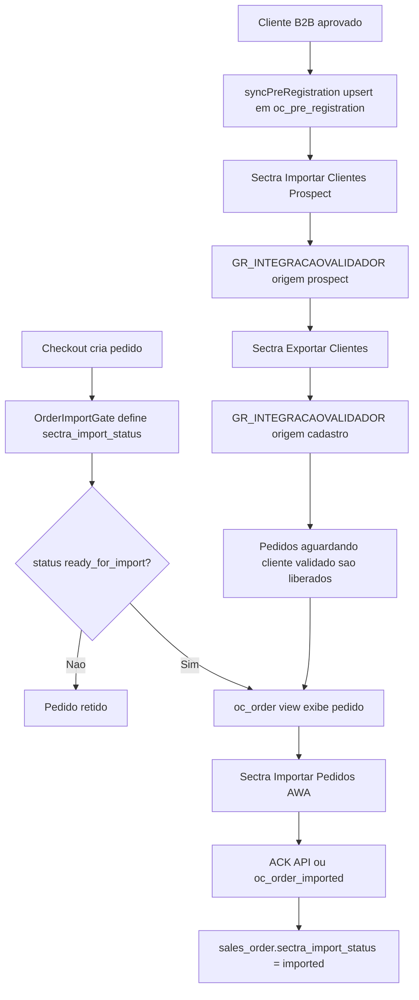

# Auditoria Integracao ERP Sectra

## Objetivo
Validar e documentar o comportamento atual da integracao Sectra para:
- Importar Clientes Prospect (fonte `oc_pre_registration`)
- Importar Pedidos AWA (fonte `oc_order`)

Tambem registrar se o comportamento atual esta equivalente ao fluxo legado onde o proprio Sectra importa prospects e pedidos.

## Escopo Tecnico
Arquivos de referencia usados nesta auditoria:
- `app/code/GrupoAwamotos/ERPIntegration/Cron/SyncOpenCartBridge.php`
- `app/code/GrupoAwamotos/ERPIntegration/Console/Command/SectraStatusCommand.php`
- `app/code/GrupoAwamotos/ERPIntegration/Model/Api/OrderPullManagement.php`
- `app/code/GrupoAwamotos/ERPIntegration/Model/B2BClientRegistration.php`
- `app/code/GrupoAwamotos/B2B/Model/Sectra/OrderImportGate.php`
- `app/code/GrupoAwamotos/B2B/Model/Sectra/SectraImportStatus.php`
- `app/code/GrupoAwamotos/ERPIntegration/etc/crontab.xml`
- `app/code/GrupoAwamotos/B2B/etc/crontab.xml`

## Fluxo Atual (Pedidos + Prospects)


## Contrato de Dados: Prospect

### Query esperada pelo Sectra (Importar Clientes Prospect)
Referencia de comportamento no codigo:
- `SyncOpenCartBridge::syncPreRegistration()`
- `SectraStatusCommand::countPreRegistrationAvailableForSectra()`

Query usada pelo desktop Sectra:
```sql
SELECT customer_id,
       firstname,
       lastname,
       email,
       telephone,
       CAST(custom_field AS CHAR(1000)) AS lkcustomfield
FROM oc_pre_registration
WHERE customer_id NOT IN (CLIENTESPRE);
```

### Confirmacao do campo `lkcustomfield`
- `lkcustomfield` vem de `oc_pre_registration.custom_field`.
- O valor e gravado com digitos limpos de CNPJ/CPF (nao JSON).
- O proprio `syncPreRegistration()` sanitiza documento removendo `.`, `/`, `-` e espaco.

## Contrato de Dados: Pedido

`oc_order` e uma view recriada periodicamente por `SyncOpenCartBridge`.

Um pedido so aparece para o Sectra quando:
- `sales_order.state IN ('new', 'pending_payment', 'processing')`
- `sales_order.sectra_import_status = 'ready_for_import'`
- cliente esta em `oc_customer_b2b_confirmed`
- CNPJ em `oc_customer.custom_field["6"]` nao esta vazio
- pedido ainda nao esta em `oc_order_imported` (anti-duplicidade)

## Status Observado em Producao (2026-06-23 UTC-3)

Fonte: `sudo -u www-data php bin/magento erp:sectra:status --prospect`
- `oc_pre_registration`: 7539 registros
- Ja em `CLIENTESPRE`: 14500
- Disponiveis para Sectra (`NOT IN CLIENTESPRE`): 0
- CNPJ/CPF invalido: 0

Fonte: `sudo -u www-data php bin/magento erp:sectra:status --orders`
- 0 pedidos em `oc_order` (bridge de pedidos vazia no momento)
- 13 pedidos pendentes no Magento, sendo 11 em `awaiting_customer_validation`
- 5 clientes na fila de Exportar Clientes: `2541, 11134, 16161, 17421, 18202`
- Sequencia operacional obrigatoria:
  1. Sectra -> Exportar Clientes
  2. Sectra -> Importar Pedidos AWA

Confirmacao de amostra em banco (`oc_pre_registration`):
- `lkcustomfield` observado com documentos de 14 digitos validos nas ultimas linhas consultadas.

## Evidencia Runtime (sessao 608fd0)

### Hipoteses e resultado
- **H1 (CONFIRMADA)**: Prospect esta aderente ao contrato `NOT IN (CLIENTESPRE)`.
  - Evidencia: log `countPreRegistrationAvailableForSectra` com `prospect_codes_count=14500` e `available_count=0`.
- **H2 (CONFIRMADA)**: Pedidos nao entram em `oc_order` porque cliente nao tem cadastro B2B (`7D4C6FBD`) no validador.
  - Evidencia: log `OrderImportGate::backfillOrderImportStatus` com `target_ready=0` e `target_awaiting_customer_validation=11`.
  - Evidencia adicional: logs `ValidatorChecker::isCustomerValidatedInSectra` mostram `in_b2b_confirmed=true` e `in_cadastro_validator=false` para clientes como `2541` e `11134`.
- **H3 (CONFIRMADA)**: Auto-registro Magento -> SQL Server nao resolve neste ambiente.
  - Evidencia 1: log `B2BClientRegistration::getWriteConnection` com `write_enabled=false` (config desabilitada).
  - Evidencia 2: apos habilitacao temporaria, log `Write connection failed` com `SQLSTATE[01002] Adaptive Server connection failed (201.33.193.193)`.
- **H8 (INCONCLUSIVA/COM FORTE INDICIO)**: Desktop Sectra pode nao estar acessando os endpoints de diagnostico desta nuvem.
  - Evidencia: ausencia de eventos `sectra-pc-*` no log da sessao e `sectra_http_probe_hit` sem registros.
  - Interpretacao: sem acesso HTTP do PC Sectra, nao ha como provar que o desktop esta realmente apontando para esta instancia Magento.

## Conclusao de Equivalencia com o Fluxo Legado

### O que esta equivalente
- O Sectra continua importando prospects diretamente de `oc_pre_registration`.
- O filtro `customer_id NOT IN (CLIENTESPRE)` permanece aderente ao contrato.
- O Sectra continua importando pedidos a partir da bridge (`oc_order`).
- A marcacao de importado continua pelo caminho legado/compatibilidade (`oc_order_imported`) e via ACK API.

### Diferenca operacional importante (requisito para equivalencia pratica)
- O desktop Sectra exige cadastro de cliente no validador (`INTEGRACAOORIGEM=7D4C6FBD`) para importar pedidos.
- Enquanto esse cadastro nao existir, o gate mantem `awaiting_customer_validation` e `oc_order` fica vazio.
- Portanto, para equivalencia pratica do comportamento esperado no desktop:
  - primeiro executar **Exportar Clientes**
  - depois executar **Importar Pedidos AWA**

## Checklist de Validacao de Equivalencia

### 1) Validar prospects disponiveis
```bash
sudo -u www-data php bin/magento erp:sectra:status --prospect
```
Esperado:
- `oc_pre_registration > 0`
- `Disponiveis p/ importacao` coerente com o desktop Sectra
- `CNPJ/CPF invalido = 0` (ou baixo, com tratativa)

### 2) Validar query do Sectra para prospects
```sql
SELECT customer_id, firstname, lastname, email, telephone,
       CAST(custom_field AS CHAR(1000)) AS lkcustomfield
FROM oc_pre_registration
WHERE customer_id NOT IN (CLIENTESPRE);
```
Esperado:
- Retorno de clientes que ainda nao estao no validador prospect.
- `lkcustomfield` contendo CNPJ/CPF.

### 3) Validar prontidao de pedidos
```bash
sudo -u www-data php bin/magento erp:sectra:status --orders
```
Esperado:
- `oc_order` com pedidos pendentes
- fila `Exportar Clientes` com clientes necessarios
- mensagem de sequencia: Exportar Clientes -> Importar Pedidos AWA

### 4) Validar se pedidos estao realmente expostos na bridge
```sql
SELECT order_id, customer_id, total
FROM oc_order
ORDER BY order_id DESC
LIMIT 50;
```
Esperado:
- pedidos com customer_id mapeado para bridge Sectra

### 5) Confirmar anti-duplicidade
```sql
SELECT COUNT(*) AS imported_count, MAX(date_imported) AS last_imported
FROM oc_order_imported;
```
Esperado:
- pedidos importados deixam de aparecer em `oc_order`.

## Diagnostico Objetivo no Momento da Auditoria
- **Prospect:** funcional e aderente ao contrato (`oc_pre_registration` + `lkcustomfield`).
- **Pedidos:** bloqueados corretamente pelo gate por falta de cadastro B2B no validador para os clientes da fila.
- **Auto-registro de cliente:** indisponivel na pratica por falha de conexao de escrita SQL Server.
- **Resultado operacional atual:** sem executar `Exportar Clientes` (ou SQL manual no INDUSTRIAL), a bridge `oc_order` permanece com 0 pedidos.

## Riscos Operacionais e Proximas Acoes

1. **Documentacao legada divergente**
   - Alguns textos antigos ainda mencionam tabelas/fluxos desatualizados.
   - Acao: manter este documento como referencia de operacao real.

2. **Dependencia de ordem operacional no desktop Sectra**
   - Se usuario executar Importar Pedidos antes de Exportar Clientes, os pedidos ficam bloqueados e o desktop retorna "Cliente nao foi encontrado".
   - Acao: padronizar runbook operacional com ordem fixa.

3. **Canal de escrita SQL Server indisponivel**
   - `erp:client:register` nao consegue abrir conexao de escrita com o host SQL Server configurado.
   - Acao: corrigir conectividade/permissao do usuario de escrita no SQL Server ou manter operacao manual via SQL gerado.

4. **Residuos de logs de debug em comandos/endpoints Sectra**
   - Foram observados pontos com escrita em `.cursor/debug-fc1127.log`.
   - Acao: remover/limpar em hardening futuro (fora do escopo desta auditoria).

5. **Visibilidade x importacao efetiva**
   - Pedido visivel em `oc_order` nao garante importacao efetiva sem cliente cadastrado no validador correto.
   - Acao: usar `erp:sectra:status --orders` como pre-check diario.

## Proximas Acoes Recomendadas (prioridade)

1. **Padronizar operacao Sectra**
   - Publicar internamente a sequencia obrigatoria:
     1) Exportar Clientes
     2) Importar Pedidos AWA

2. **Restabelecer escrita no SQL Server**
   - Habilitar/corrigir a conexao de escrita para `erp:client:register`, ou executar o SQL gerado manualmente no INDUSTRIAL.

3. **Sanear pontos de debug**
   - Remover escrita em `.cursor/debug-fc1127.log` dos comandos/endpoints de diagnostico.

4. **Revisar documentacao antiga**
   - Manter README como indice e este arquivo como fonte de verdade da integracao Sectra.

5. **Monitorar backlog de clientes**
   - Rodar `erp:sectra:status --orders` diariamente e atuar quando houver fila grande de clientes nao cadastrados.

## Comandos de Rotina (read-only)
```bash
# Visao geral prospects
sudo -u www-data php bin/magento erp:sectra:status --prospect

# Visao geral pedidos + prontidao
sudo -u www-data php bin/magento erp:sectra:status --orders

# Bridge counts
mysql -u "$MAGENTO_DB_USER" -p"$MAGENTO_DB_PASS" "$MAGENTO_DB_NAME" -e "
SELECT 'oc_pre_registration' AS tabela, COUNT(*) AS total FROM oc_pre_registration
UNION ALL
SELECT 'oc_customer_b2b_confirmed', COUNT(*) FROM oc_customer_b2b_confirmed
UNION ALL
SELECT 'oc_order', COUNT(*) FROM oc_order
UNION ALL
SELECT 'oc_order_imported', COUNT(*) FROM oc_order_imported;"
```
